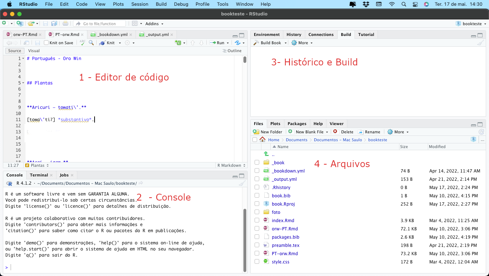
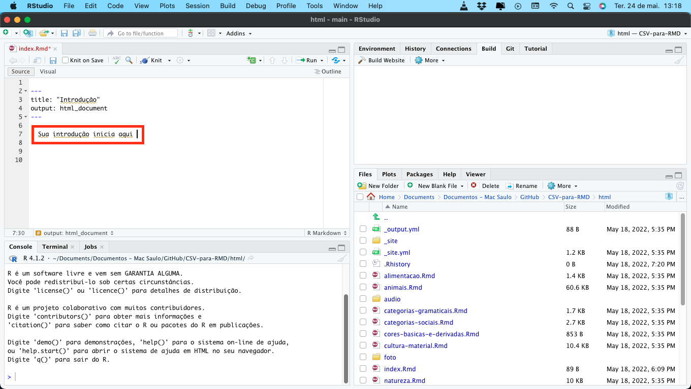

<a rel="license" href="http://creativecommons.org/licenses/by-nc/3.0/"></a><br />This work is licensed under a <a rel="license" href="http://creativecommons.org/licenses/by-nc/3.0/">Creative Commons Attribution-NonCommercial 3.0 Unported License</a>.

# csv2rmd: Um programa python para produzir dicionário multimídia com Markdown

Por favor use a referência seguinte para citar o programa em qualquer publicação que resulte de seu uso:

BRITO, Saulo; BIRCHALL, Joshua. 2022. **csv2rmd**: Um programa python para produzir dicionário multimídia com Markdown. Versão 0.1. Belém: Museu Paraense Emílio Goeldi. 

Projeto de elaboração de um script em python para criar arquivos RMD de dicionário (html ou pdf) a partir de arquivo(s) csv. Esse programa foi elaborado como parte do projeto NEH-DEL FN-266285 "Documentation and dictionary of Oro Win (orw)" do Joshua Birchall. 

## Começando

Para executar o script, será necessário:

- [Python 3](https://www.python.org/downloads/)
- [Biblioteca Pandas para Python](https://github.com/pandas-dev/pandas)
- Conhecimento básico para rodar um script python em seu sistema operacional

Na pasta de trabalho do script alguns arquivos e pastas serão necessários:

- O arquivo dicionario.csv: arquivo padrão metadados 
- O script csv2rmd.py
- Arquivo atores.csv: Arquivo opcional com nomes e siglas dos falantes envolvidos nas gravações
- Pastas padrão de mídia:  audio (audio para exemplos e entradas principais listadas no dicionario.csv), video (videos para as entradas  listadas no dicionario.csv) e foto (imagens para as entradas  listadas no dicionario.csv)

Para transformar os RMD's gerados pelo script em HTML ou PDF, você precisará:

- [MikTeX](https://miktex.org/download) (Windows)
- [MacTeX](https://www.tug.org/mactex/faq/3-4.html) (MacOS)
- [Linguagem R](https://cran.rstudio.com/)  
- [RStudio Desktop](https://www.rstudio.com/products/rstudio/download/)
- [Bookdown package](https://bookdown.org/home/about/)   (utilizado para gerar o pdf /instalado diretamente no RStudio com o comando: ```install.packages('bookdown')```)

## Preenchimento do arquivo dicionario.csv

O arquivo "dicionario.csv" nada mais é que uma planilha com valores separados por vírgula que pode ser aberto e alimentado em qualquer editor de planilhas comumente usado em computadores. Nesse arquivos as entradas são inseridas por palavra, Alguns campos utilizados na plailha são **obrigatórios** para o funcionamento correto do script:


- Item lexical	(ITEM_LEXICAL):


- Transcrição fonética (TRANSCRICAO_FONETICA)
- Classe gramatical (CLASSE_GRAMATICAL)
- Tradução ou significado (TRADUCAO_SIGNIFICADO)
- Descrição (DESCRICAO)		
- Campo semântico (CAMPO_SEMANTICO)

Os outros campos são opcionais:

- ID: Número de identificação único para entrada 
- Imagem (IMAGEM): Nome do arquivo de imagem referente a entrada que deve estar contido na pasta "foto"
- Arquivo sonoro (ARQUIVO_SONORO): Nome do arquivo de som referente a entrada que deve estar contido na pasta "audio"
- Arquivo sonoro do exemplo de uso (EXEMPLO_USO_ARQUIVO_SONORO): Nome do arquivo de som referente ao exemplo de uso da entrada que deve estar contido na pasta "audio"	
- Transcrição do exemplo (TRANSCRICAO_EXEMPLO)	
- Tradução do exemplo (TRADUCAO_EXEMPLO)	
Arquivo de vídeo (ARQUIVO_VIDEO)

É recomendado que se adicionados os arquivos de som as respectivas traduções e e transcrições sejam adicionadas.


### Exemplo de preenchimento do arquivo dicionario.csv


ID|ITEM_LEXICAL|IMAGEM|ARQUIVO_SONORO|TRANSCRICAO_FONETICA|CLASSE_GRAMATICAL|TRADUCAO_SIGNIFICADO|DESCRICAO|EXEMPLO_USO_ARQUIVO_SONORO|TRANSCRICAO_EXEMPLO|TRADUCAO_EXEMPLO|ARQUIVO_VIDEO|CAMPO_SEMANTICO|ITENS_RELACIONADOS|
|---|---|---|---|---|---|---|---|---|---|---|---|---|---|
||kawajikam ||orw_20200224_lw_co_01_macaco_kawajikam.wav|[kawaji'kam]|substantivo|cipó para manufatura|Descrição 1|orw_20200224_lw_co_01_macaco_kawajikam_ex.wav|ten ta kawajikam mam fo' a ta|eu vou fazer uma vassoura de cipó|||plantas||
||sakat||orw_20200224_lw_co_01_macaco_sakat.wav|[sa'kat]|verbo|rachar|Descrição 3|orw_20200224_lw_co_01_macaco_sakat_ex.wav|ta' sakat onon|eu cortei e rachei (o cipó)|||verbos de ação||


## Rodando o script

Uma vez que os pré requisitos para rodar o script tenham sido atendidos, você pode executar o mesmo utilizando linha de comando ou usando editores como o própio IDLE que vem junto da instalação do python. 


### Opções disponíveis no script

 - ```1 - Validar tabela ("dicionario.csv")```: Cria um arquivo de texto para pendências em campos essenciais para rodar o script (ITEM_LEXICAL, TRANSCRICAO_FONETICA, CLASSE_GRAMATICAL, CLASSE_GRAMATICAL, CAMPO_SEMANTICO.) e um arquivo de texto para pendências  em arquivos (arquivos da tabela não contidos na pasta), o arquivo para descrever as pendencias de arquivo vai adicionar também o número de entradas na planilha sem determinados tipos de arquivo

- ```2 - Gerar arquivos RMD para criar PDF```: Cria os arquivos RMD para utilizar em um projeto Bookdown no RStudio organizados em “língua-pt” e “pt-língua” (necessário informar um código para o nome da língua para noemar os arquivos RMD, e o nome da língua como deve aparecer no documento)

- ```3 - Gerar arquivos RMD para criar HTML```: Cria os RMD’s separados por campos semânticos para criar um site html (necessário informar o nome do autor e o nome da língua como deve aparecer no documento)

É importante validar a tabela e corrigir possíveis falhas antes de gerar arquivos RMD. As opções de gerar HTML ou PDF irão gerar pastas com os arquivos necessários para criar os produtos no RStudio.

#### Opção de informação de autor e data aos arquivos de áudio e vídeo no html

 Ao utilizar a opção de  ```Gerar arquivos RMD para criar HTML``` você tera a opção de adicionar as informações de autor e data para os arquivos de áudio e vídeo no entando para utilizar essa versão é necessário que os arquivos estejam  com a nomeclatura padrão do Museu Goeldi:

 <p align="center">COD-AAAAMMDD-PES-FAL-FAL-sessao-num</p>


 - COD: Código da língua (três dígitos)
 - AAAAMMDD: data no formato ano, mês e dia(exemplo: 20220517)
 - PES: Sigla para o pesquisador (Maiúsculo)
 - FAL: Sigla para os falantes da sessão (Maiúsculo)
 - sessao: Um título para o arquivo ou um conjuntos de arquivos
 - num: uma numeração opcional para distinguir arquivos do mesmo formato que façam parte da mesma sessão.


 Além da nomeclatura é necessário o uso de um arquivo CSV contendo as informações de autor e sigla dos falantes que você deseja que apareçam no documento como a seguir:

codigo|ator
|---|---|
TI|Ti'omi Oro Towati'
CO|Parira Oro Win
HO|Hoto Oro Win
MA|Maria Oro Win

## Gerando os produtos no RStudio

Antes de gerar os produtos no Rstudio e necessário conhecer o programa, em essencial podemos destacar as partes que compõem a tela principal do mesmo onde estarão as principais opções que vamos utilizar:





Na primeira parte da tela (1 - Editor de código) podemos observar o conteúdo dos arquivos gerados pelo script. Na segunda parte (2 - Console) podemos enviar comandos específicos para o programa (por exemplo, podes digitar ```install.packages('bookdown')```  para instalar a extensão necessária para gerar o arquivo pdf). Na terceira parte da tela (3 - Historico Build) em build podemos iniciar o processo de criação dos projetos. Na quarta parte da tela (4 - Arquivos) temos acesso aos arquivos contidos na pasta do projeto que poderão ser editados na tela 1.

### Criando um pdf

Se o seu projeto incluir imagens, o primeiro passo será transferir a pasta foto ou uma cópia da mesma para dentro da pasta "pdf".

Na pasta gerada pelo script (pasta "pdf") você deverá abrir o arquivo "book.Rproj", a tela principal  do Rstudio será aberta com os arquivos do projeto disponíveis na parte 4 da tela, você deverá então seguir os passos unicamente na tela do Rstudio:

- Abrir o arquivo "index.Rmd" (4 - Arquivos)
- Editar o arquivo "index.Rmd" (1 - Editor de código) Aqui você pode adicionar uma Introdução abaixo de "## Introdução"  ou apagar "## Introdução" para que o arquivo pdf saia sem uma página dedicada ao texto introdutório
-  Clicar na aba ```Build``` e em ```Build Book```

Depois de seguir  esses passos você vai encontrar o arquivo pdf gerado em uma pasta chamada "_book" dentro da pasta "pdf".

### Criando um dicionário  multimídia HTML

Se o seu projeto incluir áudios, fotos ou vídeos, o primeiro passo será transferir as pastas de midia ou cópias das mesmas para dentro da pasta "html".

Na pasta gerada pelo script (pasta "html") você deverá abrir o arquivo "site.Rproj", a tela principal  do Rstudio será aberta com os arquivos do projeto disponíveis na parte 4 da tela, você deverá então seguir os passos unicamente na tela do Rstudio:

- Abrir o arquivo "index.Rmd" (4 - Arquivos)
- Editar o arquivo "index.Rmd" (1 - Editor de código) Aqui você pode adicionar uma Introdução abaixo de "---" (verificar imagem abaixo), neste caso a introdução e recomendada, pois uma página inicial com título "Introdução" será gerada (o titulo é introdução mas o arquivo continua sendo "index.html") sem introdução esta pagina ficará vazia. 
-  Clicar na aba ```Build``` e em ```Build Website```



## Customização do projeto (links úteis)

Um projeto do Rstudio pode ser costumizado de diversas maneiras, para tal e necessário conhecer os arquivos de configurações e a opções disponiveis nestes arquivos, para tal seguem alguns links úteis sobre os projetos de site em HTML e PDF's em R Markdown:

(listar links e tutoriais)


